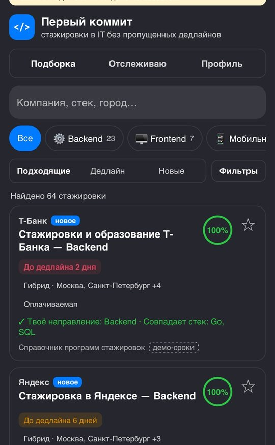
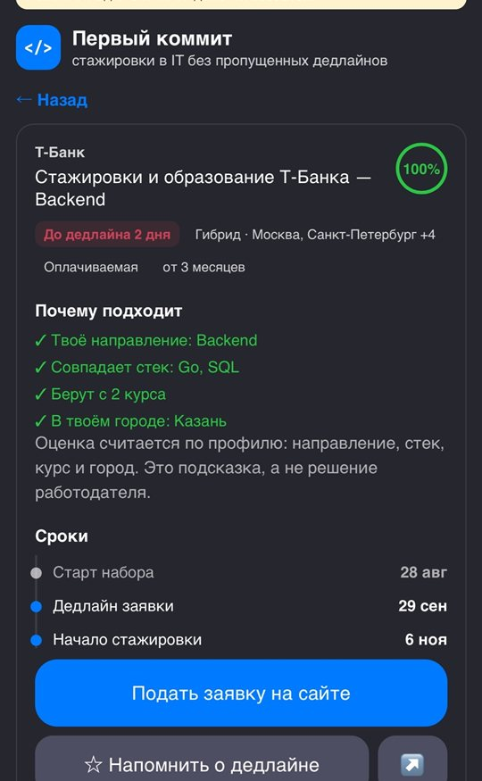
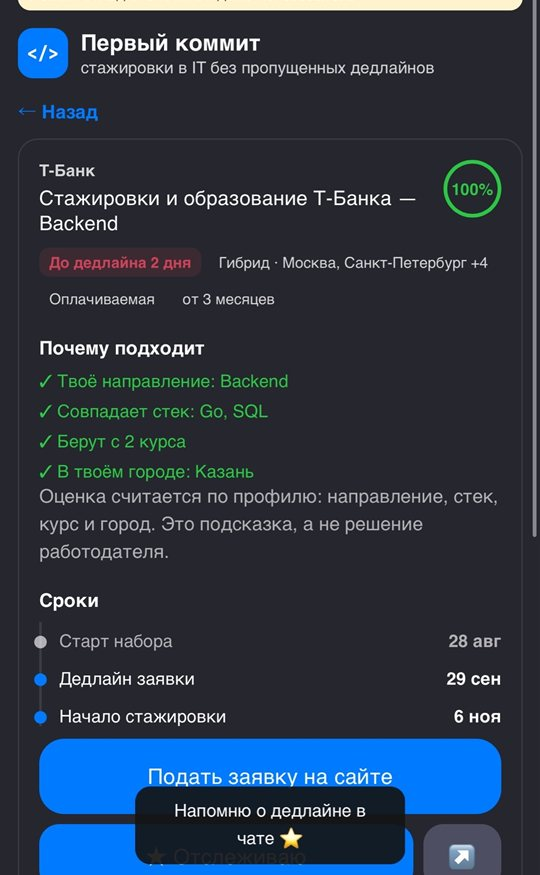
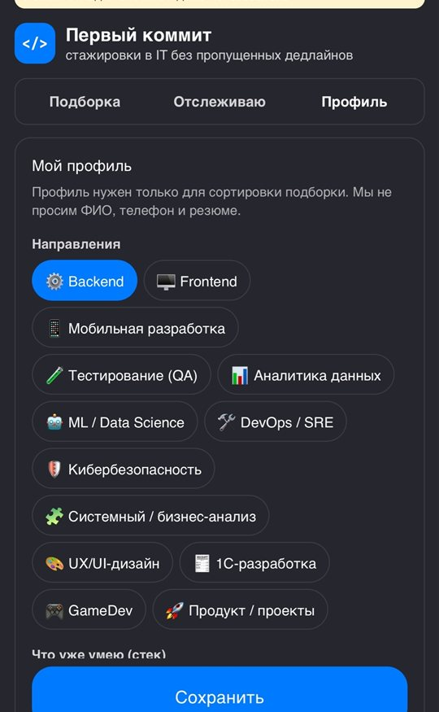
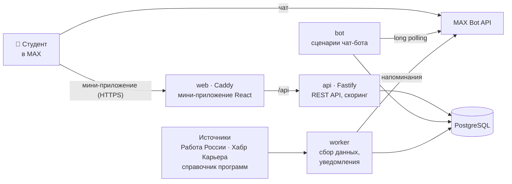
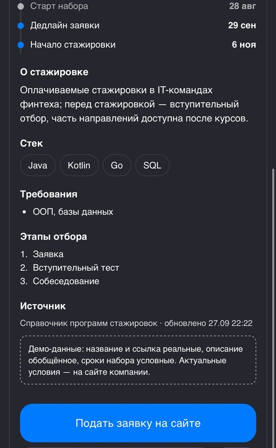

<div align="center">

# 🚀 Первый коммит

**Чат-бот и мини-приложение в MAX, которые помогают студентам найти первую IT-стажировку и не пропустить дедлайн**
MAX Bot API · Node.js · React · PostgreSQL · Docker

[](https://github.com/Aristeyy/FirstCommit/actions/workflows/ci.yml)
[](https://dev.max.ru/)
[](https://nodejs.org/)
[](https://www.typescriptlang.org/)
[](https://fastify.dev/)
[](https://react.dev/)
[](https://www.postgresql.org/)
[](https://docs.docker.com/compose/)
[](LICENSE)

&nbsp;
&nbsp;
&nbsp;


<sub>Хакатон MAX · трек «Образовательные решения» · направление «Карьера и стажировки»</sub>

</div>

---

## ✨ Что это

Студенту 2–4 курса, который ищет первую стажировку, приходится вручную следить за десятками карьерных сайтов с разными сроками набора, требованиями к курсу и форматами работы. В итоге дедлайны пропускаются, а на поиск уходят часы.

**Первый коммит** собирает стажировки из нескольких источников, ранжирует их под профиль студента с понятным объяснением «почему подходит» и заранее напоминает в чате MAX о закрытии набора. Путь пользователя занимает пару минут: три вопроса боту → персональная подборка → отслеживание → напоминание → заявка на сайте работодателя.

## 🏗️ Как это устроено



1. **Бот** знакомится со студентом тремя вопросами на кнопках: направление, курс, город или удалёнка.
2. **Worker** по расписанию собирает стажировки из источников, определяет направление и стек, отсеивает не-IT вакансии.
3. **API** ранжирует записи под профиль и отдаёт их мини-приложению. Пользователь определяется только по проверенной подписи `initData`.
4. **Worker** следит за дедлайнами отслеживаемых программ и присылает напоминания. Кнопка в уведомлении открывает нужную карточку сразу в мини-приложении.

Сервисы `api`, `bot` и `worker` собираются в один Docker-образ и запускаются с разными командами: общая доменная логика, одна сборка.

## 🚀 Возможности

- **🤖 Онбординг в чате.** Профиль за три вопроса и топ-3 стажировки прямо в переписке с ботом.
- **🎯 Прозрачный скоринг.** Процент соответствия с причинами и предупреждениями: направление, стек, курс, формат и город. Без ML и LLM, каждое слагаемое видно пользователю.
- **🔎 Подборка с фильтрами.** Направление, стек, формат, город, статус набора, оплата, курс и поиск по тексту.
- **📋 Подробная карточка.** Сроки (старт набора → дедлайн → начало), требования, этапы отбора, источник и дата обновления.
- **⏰ Напоминания о дедлайнах.** За 7, 3 и 1 день до закрытия набора, с диплинком на карточку.
- **📬 Дайджест вакансий.** Новые подходящие позиции из источников с постоянным набором.
- **🔐 Безопасность и 152-ФЗ.** Проверка подписи `initData` (HMAC-SHA256), хранится только профиль из MAX и добровольно указанные предпочтения.
- **🌗 Нативный вид.** Компоненты MAX UI, светлая и тёмная тема.

**Карточка стажировки** — сроки, этапы отбора и действия: подать заявку, напомнить о дедлайне, поделиться:



## 📱 Возможности платформы MAX

| Возможность | Как используется |
| --- | --- |
| Бот на официальном SDK | `@maxhub/max-bot-api`: онбординг, меню, топ-3, отслеживание |
| Диплинк `start_param` | уведомление о дедлайне открывает мини-приложение сразу на карточке |
| Подпись `initData` | общий профиль для бота и мини-приложения, серверная проверка HMAC-SHA256 |
| MAX Bridge | кнопка «Назад», тактильный отклик, `openLink`, `shareContent` |
| MAX UI | компоненты и цветовые токены MAX, светлая и тёмная тема |

## 🛠️ Стек

| Слой | Технологии |
| --- | --- |
| Бот и воркер | Node.js 22, TypeScript, `@maxhub/max-bot-api` |
| Backend | Fastify 5, zod, cheerio |
| Хранилище | PostgreSQL 16 |
| Мини-приложение | React 19, Vite, MAX UI, MAX Bridge |
| Веб-сервер | Caddy (статика, прокси `/api`, HTTPS через Let's Encrypt) |
| Инфраструктура | Docker Compose, Cloudflare Tunnel для разработки |

## ⚡ Быстрый старт

> Нужен только Docker (Docker Desktop или Docker Engine + Compose v2). Сборка занимает около 40 секунд.

```bash
git clone https://github.com/Aristeyy/FirstCommit.git
cd FirstCommit

cp .env.example .env        # вписать MAX_BOT_TOKEN
docker compose up -d --build
```

Мини-приложение будет доступно на <http://localhost:8080>. Чтобы открыть его в обычном браузере без MAX, включите `ALLOW_DEV_AUTH=true`: вход выполнится демо-пользователем.

### 🌐 Публикация в MAX

Внутри MAX мини-приложение открывается только по HTTPS. Самый простой вариант — VPS: домен покупать не нужно, имя даёт sslip.io, а сертификат Caddy выпускает сам.

```bash
# на VPS с открытыми портами 80 и 443, IP сервера 1.2.3.4
SITE_ADDRESS=1-2-3-4.sslip.io docker compose -f compose.yaml -f compose.vps.yaml up -d --build
```

Полученный адрес `https://1-2-3-4.sslip.io` укажите в платформе MAX для партнёров: **Чат-боты → ⋮ → Настройки → URL мини-приложения**. Для локальной разработки подойдёт временный туннель: `docker compose --profile tunnel up -d`.

## ⚙️ Настройки

| Переменная | Назначение |
| --- | --- |
| `MAX_BOT_TOKEN` | токен бота MAX — **единственная обязательная** |
| `DATA_MODE` | `live` — реальные источники, `offline` — только сохранённые снимки |
| `ALLOW_DEV_AUTH` | вход демо-пользователем в браузере, только для отладки |
| `WEB_PORT` | порт мини-приложения на хосте, по умолчанию `8080` |
| `PARSER_INTERVAL_MIN` / `NOTIFY_INTERVAL_MIN` | период сбора данных и проверки уведомлений |

Полный список — в [`.env.example`](.env.example) и [подробной документации](docs/DETAILS.md#5-параметры-и-переменные-окружения).

## 📊 Данные

| Источник | Что даёт |
| --- | --- |
| [Работа России](https://opendata.trudvsem.ru/) | вакансии для стажёров через официальный открытый API |
| [Хабр Карьера](https://career.habr.com/) | вакансии уровня «Стажёр» с публичных страниц |
| Справочник программ | 12 сезонных стажировок крупных компаний, сроки наборов демонстрационные |

У каждой записи в интерфейсе видны источник и дата обновления. Если источник недоступен, используется сохранённый снимок, поэтому проект работает и без интернета.

## 🧪 Тесты

```bash
cd backend && npm ci && npm test
```

Покрыты подпись `initData`, сессии, классификация, скоринг, статусы наборов и парсеры на снимках источников.

## 🗂️ Структура

```
FirstCommit/
├── backend/
│   ├── src/
│   │   ├── api/          # REST API и проверка initData
│   │   ├── bot/          # сценарии чат-бота
│   │   ├── domain/       # справочники, классификация, скоринг, поиск
│   │   ├── parsers/      # адаптеры источников данных
│   │   ├── notify/       # напоминания и дайджесты
│   │   └── db/           # подключение, миграции, запросы
│   ├── seed/             # справочник программ и снимки источников
│   └── scripts/          # обновление снимков
├── miniapp/src/          # мини-приложение: экраны, компоненты, MAX Bridge
├── infra/                # Caddyfile, корневые сертификаты Минцифры
├── docs/                 # подробная документация и скриншоты
├── compose.yaml          # все сервисы одной командой
└── compose.vps.yaml      # постоянный HTTPS на VPS
```

## 📖 Документация

Порты, внешние интеграции, пошаговый сценарий проверки, ожидаемое поведение и известные ограничения описаны в [docs/DETAILS.md](docs/DETAILS.md).

## 🔐 Безопасность

Об уязвимостях сообщайте приватно, как описано в [SECURITY.md](SECURITY.md).

## 📄 Лицензия

[MIT](LICENSE)

---

Проект для Хакатона MAX · автор [@Aristeyy](https://github.com/Aristeyy)
